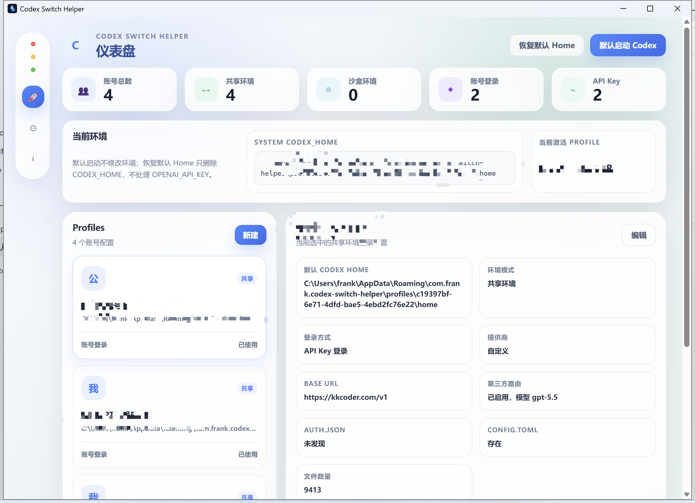

# Codex Switch Helper

Tauri desktop helper for switching Codex App profiles on Windows.

[简体中文](README.zh-CN.md)

## Screenshot



## What It Does

- Manages multiple Codex Profiles with separate saved auth data.
- Supports two environment modes: shared environment and sandbox mode.
- Supports account-login Profiles and API-key Profiles.
- Supports HTTP and SOCKS5 proxy settings for the helper app and Codex launches.
- Provides protective confirmation dialogs for dangerous actions such as deleting Profiles or changing user-level environment variables.
- Launches the Windows Codex App through `shell:AppsFolder`.
- Can restore default Codex Home behavior by deleting user-level `CODEX_HOME`.
- Checks for app updates through signed Tauri updater artifacts published on GitHub Releases.

## Environment Modes

### Shared environment

Shared environment Profiles reuse one Codex Home path and the app switches only the Profile-specific data needed for identity and model behavior:

- Account Profiles write their saved `auth.json` into the shared Home.
- API-key Profiles write their saved `OPENAI_API_KEY` and remove stale `auth.json` from the shared Home.
- Profile-specific `config.toml` content is written into the shared Home so model/provider settings switch with the Profile.
- The app writes user-level `CODEX_HOME` to the shared Home before launch.

This mode is useful when Profiles should share local sessions, caches, tools, and other Codex Home state while still switching accounts and model configuration.

### Sandbox mode

Sandbox mode preserves the original isolated behavior:

- New Profiles copy the selected source Codex Home into `app_data/profiles/<profileId>/home`.
- Launching a sandbox Profile writes user-level `CODEX_HOME` to that managed Home.
- Deleting a sandbox Profile deletes only the tool-owned managed Home, not the original import source.

Use sandbox mode when you want a Profile to keep fully isolated Codex Home state.

## Auth Behavior

- Account-login Profiles clear user-level `OPENAI_API_KEY` before launch.
- API-key Profiles write their saved key to user-level `OPENAI_API_KEY` before launch.
- API keys and saved auth/config data are currently stored in local JSON without encryption.

## Default Launch

- `默认启动 Codex` launches Codex without changing `CODEX_HOME` or `OPENAI_API_KEY`.
- `恢复默认 Home` deletes user-level `CODEX_HOME`, so manual Codex launches fall back to the default home, usually `C:\Users\frank\.codex`.

## Settings And Proxy

The settings page contains Codex launch settings and proxy settings.

- Proxy supports `http` and `socks5`.
- Saving proxy settings applies them to this helper app immediately.
- Launching Codex with proxy enabled writes user-level `HTTP_PROXY`, `HTTPS_PROXY`, and `ALL_PROXY`.
- Launching Codex with proxy disabled clears the proxy environment variables managed by this app.
- Dangerous operations use in-app confirmation dialogs. Deleting a Profile requires typing the Profile name.

## Testing With Alternate Data

Set `CODEX_SWITCH_HELPER_DATA_FILE` to test against another data file without touching the real `data.json`:

```powershell
$env:CODEX_SWITCH_HELPER_DATA_FILE="C:\Users\frank\AppData\Roaming\com.frank.codex-switch-helper\data-test.json"
npm run tauri:dev
```

## Default Codex AppID

```text
OpenAI.Codex_2p2nqsd0c76g0!App
```

The app auto-detects `OpenAI.Codex_*` first to avoid unrelated apps that happen to contain `Codex` in their name. You can change the AppID in advanced settings if needed.

## Development

```bash
npm install
npm run tauri:dev
```

## Build

```bash
npm run tauri:build
```

On Windows, Rust/Tauri requires the Visual Studio Build Tools C++ toolchain. If `cargo check` or `tauri build` reports `link.exe not found`, install Visual Studio Build Tools with the C++ workload.

## App Updates

The app checks GitHub Releases for signed updater metadata at startup and also provides a manual update check in the About panel.

Before publishing updater-enabled releases, add these repository secrets:

- `TAURI_SIGNING_PRIVATE_KEY`: contents of `updater.key.local`
- `TAURI_SIGNING_PRIVATE_KEY_PASSWORD`: contents of `updater.key.password.local`

Keep both files private. Losing the key or password prevents installed apps from accepting future updates.

## Release

Before publishing a release:

```bash
npm run build
cd src-tauri
cargo fmt --check
cargo check
cd ..
npm run tauri:build
```

Also update `CHANGELOG.md`, `README.md`, and `README.zh-CN.md` before tagging a release.

Current release: `0.1.5`.
