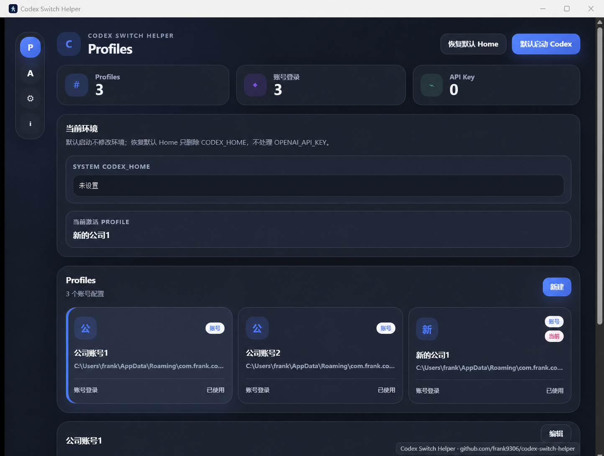
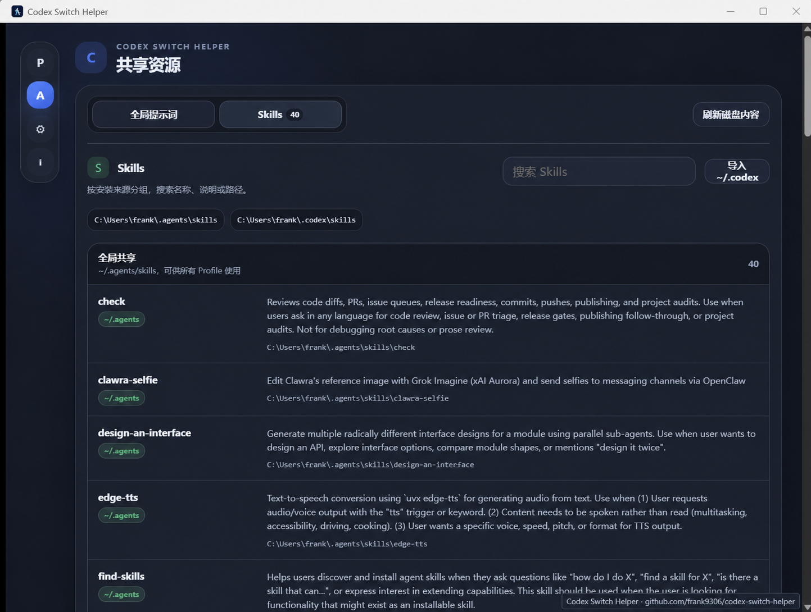
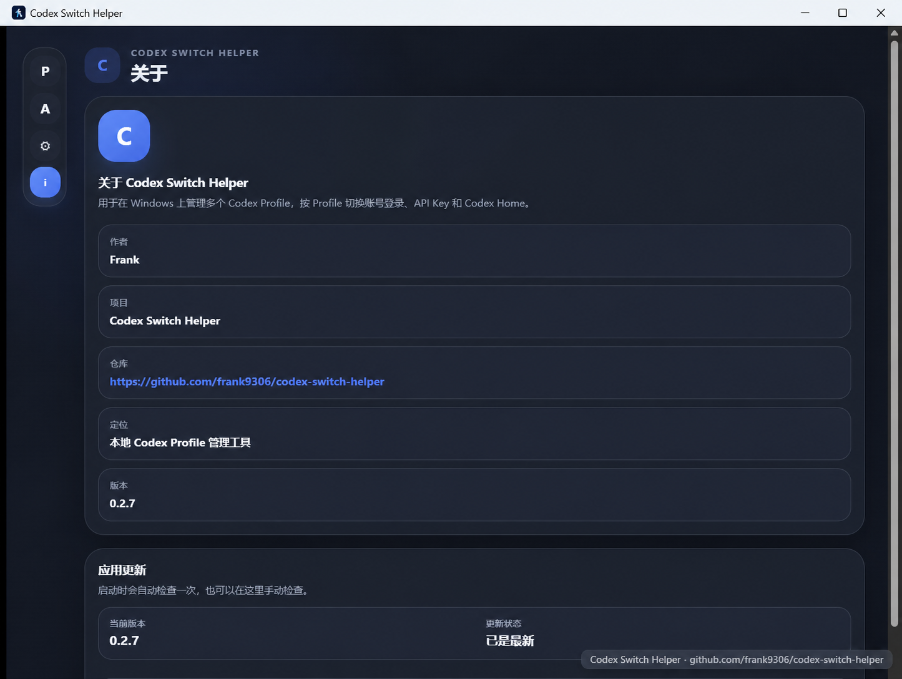

# 推荐标题

## 同时用多个 Codex 账号，不必再反复登录：这个 Windows 小工具把环境彻底分开了

### 备选标题

- Codex 多账号用户终于不用来回折腾了：一键切换 Profile，还能多开
- 把 Codex 的账号、API Key 和配置分开管理，这个开源工具做到了
- Codex Switch Helper：给每个 Codex 账号一套互不干扰的独立环境
- 如果你经常切换 Codex 账号，这个 Windows 工具值得一个 Star

---

# 同时用多个 Codex 账号，不必再反复登录：这个 Windows 小工具把环境彻底分开了

如果你只使用一个 Codex 账号，默认客户端已经足够简单。

但只要开始在个人账号、工作账号和不同 API Key 之间切换，麻烦就会接连出现：登录状态容易互相覆盖，`CODEX_HOME` 和 `config.toml` 要手动确认，代理需要重复调整，想同时开两个 Codex 实例更是处处受限。

[Codex Switch Helper](https://github.com/frank9306/codex-switch-helper) 就是为这个场景做的。它是一款面向 Windows 的开源桌面工具，把不同 Codex 使用环境整理成一个个独立 Profile。

你只需要选择 Profile 并点击启动，账号、Home、应用数据目录和代理设置都会跟着对应环境走。

它解决的不是“怎么换一个账号”，而是“怎么让多个 Codex 环境长期共存，而且互不打架”。

*图 1：实际运行界面。所有 Codex Profile 集中显示在一个界面中，账号登录和 API Key 登录状态一眼可见。*

## 真正的优势，是每个 Profile 都有自己的“房间”

很多所谓的账号切换，本质上只是反复替换同一份登录文件。切换成功了，但原来的配置、凭据和运行状态仍可能互相影响。

Codex Switch Helper 的做法更彻底：每个 Profile 都会使用工具托管的独立 Home，并在启动时获得独立的 `CODEX_HOME` 和 `--user-data-dir`。这意味着个人账号、公司账号、测试账号以及不同 API 服务，可以各自保留登录状态和配置。

例如，你可以这样分：

- “个人开发”使用 Codex 账号登录；
- “公司项目”使用另一套账号和独立配置；
- “模型测试”使用 API Key、自定义 Base URL 和模型；
- “海外网络”单独走 HTTP 或 SOCKS5 代理。

选中哪个 Profile，就用哪套环境启动。无需每次寻找 `auth.json`，也不用在系统环境变量里来回改 `OPENAI_API_KEY`。

## 不只是切换，还能同时运行

“切换账号”只能解决先后使用的问题。真正影响工作流的，是你可能需要让两个 Codex 同时处理不同任务。

Codex Switch Helper 会为每个 Profile 使用独立应用数据目录，因此可以并行启动多个相互隔离的 Codex 实例。一个实例处理工作仓库，另一个实例研究个人项目，不必关掉当前窗口再重新登录。

工具还提供实例状态与停止操作。Profile 检查、启动准备和进程状态查询放在 UI 事件线程之外执行，即使 Codex 正在处理大型任务，切换工具本身也尽量保持响应。

## 账号登录和 API Key，不必二选一

新建 Profile 时，可以直接选择“账号登录”或“API Key 登录”。

账号 Profile 创建后，在对应的 Codex 窗口中完成登录即可，不要求你先手动寻找或复制 `auth.json`。API Key Profile 则会把密钥仅传给对应的 Codex 进程，并清理目标 Home 中可能残留的 `auth.json`，避免看起来像是仍在使用上一个账号。

对于使用 MiniMax、DeepSeek 或自定义兼容服务的用户，还可以为 Profile 配置 Base URL、模型和自定义 Provider。不同服务各建一个 Profile，切换时不用重新填写整套参数。

需要说明的是，当前版本的 API Key 以及保存的 auth/config 数据仍以明文形式存储在本地 JSON 中，适合个人受控设备使用；共享电脑或高安全要求环境应谨慎保存敏感凭据。

## 连 AGENTS.md、Skills、Plugins 和代理也一起管了

多 Profile 最容易带来的另一个问题，是公共能力逐渐散落：这个 Home 有某个 Skill，另一个 Home 有新版 `AGENTS.md`，最后没人记得哪份才是最新的。

Codex Switch Helper 提供了共享资源页面：

- 直接查看、编辑并刷新全局 `~/.agents/AGENTS.md`；
- 让所有托管 Profile Home 链接到同一份全局提示词；
- 同时发现 `~/.agents/skills` 与 `~/.codex/skills`；
- 把默认 Home 中缺失的 Skills 导入共享目录，遇到同名内容会跳过，不覆盖现有文件。

从 v0.2.8 开始，第三方 Plugins 也可以集中管理。工具会从托管 Profile 汇总非官方插件，保存到 `~/.agents/plugins`，再通过本地 `agents-shared` Marketplace 同步到所有托管 Profile。同名同版本但内容不同的插件会被标记为冲突，不会静默覆盖；OpenAI 官方插件缓存则不会被复制进共享库。

代理设置也集中在工具中，支持 HTTP 和 SOCKS5。保存后，工具自身会立即使用新代理，之后启动的 Codex 实例也会获得对应的进程环境。`localhost`、`127.0.0.1` 和 `::1` 默认绕过代理，已有的 `NO_PROXY` 配置会被保留。

*图 2：共享资源页面。Skills 可以按来源浏览、搜索、刷新，并将缺失内容安全导入共享目录。*

## 它也给误操作留了刹车

环境管理工具最怕“一键方便，一键误删”。Codex Switch Helper 对会影响用户环境或本地数据的操作增加了确认步骤：启动独立环境前会说明实际变更，恢复默认 Home 只删除用户级 `CODEX_HOME`，删除 Profile 时则必须输入 Profile 名称确认。

旧版共享 Profile 迁移到托管 Home 时采用复制方式，原目录不会被删除；删除 Profile 时，也只处理该工具拥有的托管目录。

此外，它支持 Windows 系统托盘、登录 Windows 后自动启动、Light/Dark 主题，以及基于 GitHub Releases 签名产物的应用内更新。它更像一个可以常驻的 Codex 控制台，而不是用完即走的账号替换脚本。

*图 3：应用内可以直接确认项目地址、当前版本和更新状态。*

## 下载后，三步就能开始

1. 前往 [GitHub Releases](https://github.com/frank9306/codex-switch-helper/releases/latest) 下载最新 Windows 版本；
2. 新建 Profile，选择账号登录或 API Key 登录；
3. 点击启动，在独立的 Codex 窗口里开始工作。

截至 2026 年 7 月 23 日，当前公开版本为 **v0.2.7**，v0.2.8 正在开发中。项目仍在快速迭代，如果你依赖复杂的企业凭据策略，建议先阅读 README 中的本地存储说明。

## 如果它替你省掉一次重复登录，请顺手点个 Star

开源小工具最需要的，不只是下载量，而是一个明确的信号：有人真的遇到了这个问题，也希望项目继续维护。

如果 Codex Switch Helper 让你少改一次环境变量、少复制一次配置，或者终于能把两个 Codex 实例同时开起来，欢迎到 [GitHub 仓库](https://github.com/frank9306/codex-switch-helper) 点一下 **Star**。

这个 Star 不只是“支持一下”。它会让更多同样被多账号、多 API Key 和多环境切换困扰的人，更容易在搜索和推荐中发现这个工具；也能让作者知道，下一次兼容性修复、体验优化和新版本发布，确实有人在等。

**先 Star，方便以后找回来；再下载，让 Codex 的每套环境各归其位。**

---

## 配图制作清单

| 位置 | 用途 | 画面要求 | 图注 | Alt 文本 | 披露 |
|---|---|---|---|---|---|
| 开篇后 | 快速建立产品认知 | Profile 总览与当前环境，右下角带项目水印 | 所有 Codex Profile 集中显示，账号登录和 API Key 登录状态一眼可见 | Codex Switch Helper 的 Profile 管理界面 | 真实产品截图；水印后处理 |
| “共享资源”一节后 | 展示附加价值 | Skills 页面，包含搜索、来源分组、刷新与导入入口 | Skills 可以按来源浏览、搜索、刷新，并安全导入共享目录 | Codex Switch Helper 的 Skills 管理页 | 真实产品截图；水印后处理 |
| “误操作保护”一节后 | 建立项目可信度 | 关于与更新页，显示仓库、版本和更新状态 | 应用内可以直接确认项目地址、当前版本和更新状态 | Codex Switch Helper 的关于与更新页 | 真实产品截图；水印后处理 |

## 事实核查说明

- 项目定位、Profile 隔离、并行实例、账号/API Key 登录、共享 AGENTS.md 与 Skills、代理、确认弹窗、系统托盘和更新能力，依据仓库 `README.zh-CN.md`、`CHANGELOG.md`、`src/main.tsx` 与 `src-tauri/tauri.conf.json`。
- v0.2.8 的功能与版本信息依据待发布代码、README、CHANGELOG 和 Tauri 配置核对；在正式发布前，GitHub Releases 中的最新稳定版本仍应为 v0.2.7。
- “尽量保持响应”是对异步 Profile 检查、启动准备和进程查询机制的体验性概括，不代表所有设备上的性能承诺。
- 文章没有宣称该工具会加密本地凭据；当前 API Key 及保存的 auth/config 数据明文存储在本地 JSON 中。
- 文中三张图片均于 2026 年 7 月 23 日从正在运行的应用重新截取，并添加统一项目水印；未继续使用仓库中的旧截图。
